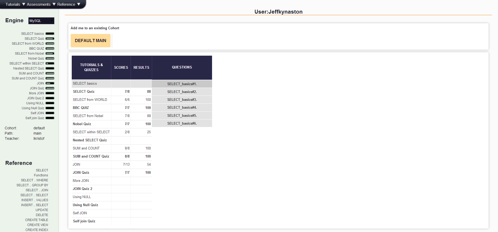

## U3.W7: SQLZoo

####I worked on this challenge [by myself].

### My Quiz Results:

### Reflection

The syntax is entirely new, but the theory and capabilities of SQL is pretty familiar to me. At my consulting firm in San Francisco we worked in Microsoft Access all day, every day, querying databses of hospital claims. Although we hardly ever wrote or even looked at the actaul SQL code, we were still writing SQL queries using a graphical interface. I have a lot of experience with the basic functionality like joining tables and groubing by fields. In Microsoft Access you can write complex queries with their GUI and then switch to the SQL code view - I think this would be agood tactic for learning more advacned SQL. 