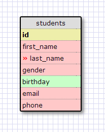

# U3.W7: Designing Schemas

#### I worked on this challenge [by myself]

## Release 0: Student Roster Schema

## Release 1: One to Many Schema

## Release 2: One to One Schema

## Release 3: Many to Many Schema

## Release 4: Design your own Schema
Description of what you're modeling: 

I have some experience with databases of medical claims so I used that theme for my schemas. For my one to one relationship, I use the example of a special test group. Every patient in the special test group has only one id, which corresponds to the unique (and optional) special_test_group_patient_id field in the master patient's table. 

For my may-to-many relationship, I used doctors and patients. Patients can have more than one doctor, and doctors certainly have more than one patient. I connected these using a join table. 

## Release 5: Reflection

At first I thought that drawing these out in socrates was a little time consuming, but in the end I think that it helped me learn. Naming conventions and standard practices are still a little new to me, so it a little repitition helped that stick. Also, creating our own schemas definitely helped solidify how and when to use the one-to-one and many-to-many relationships. 

A lot of what I've done in medicine and accounting has involved databases, so I know they will play an integral part in my future coding. All of the types of accounting applications i'm imagining will involve databases, so I am excited to learn this part of web development.