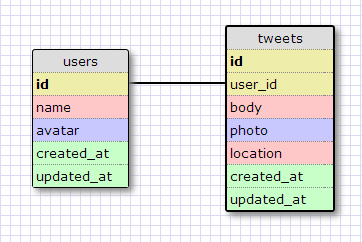

# U3.W7: Modeling a Real-World Database (SOLO CHALLENGE)

## Release 0: Users Fields
 
users 
 
id 
name 
avatar 
created_at 
updated_at 
 
 
 
tweets?? 
followers?? 
followed_users??? 
=> I think these would all be separate tables 

## Release 1: Tweet Fields
 
tweets 
 
id - auto incriment 
user_id - required 
body - required 
photo - optional 
location - optional 

## Release 2: Explain the relationship
The relationship between `users` and `tweets` is: one-to-many 
Each user can have more than one tweet, but each tweet belongs to only one user. 

## Release 3: Schema Design

## Release 4: SQL Statements
`SELECT user_id, body  
	FROM users JOIN tweets ON (users.id=user_id) 
  	WHERE user_id = 'jeffkynaston'` 

`SELECT user_id, body 
	FROM users JOIN tweets ON (users.id=user_id) 
  	WHERE user_id = 'jeffkynaston' 
   	AND created_at > 5/14/14`` 

`SELECT name 
	FROM users JOIN tweets ON (users.id=user_id) 
		WHERE tweet.id = '14402084'` 

## Release 5: Reflection
<!-- Be sure to add your reflection here!!! -->