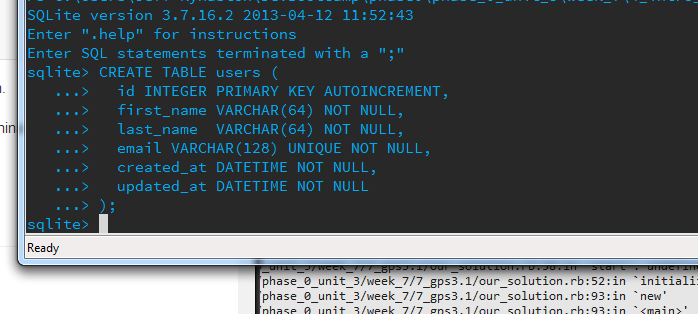
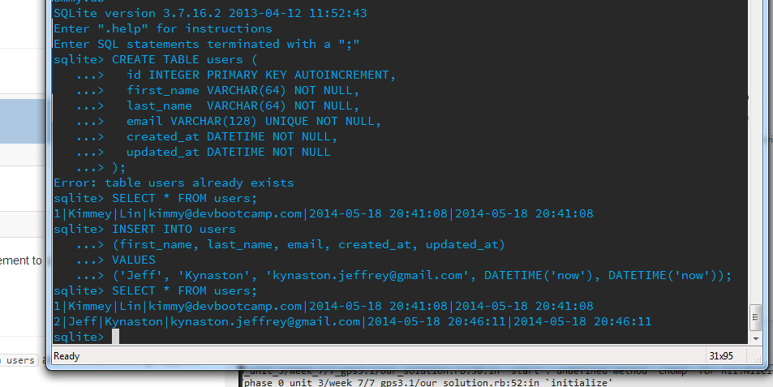
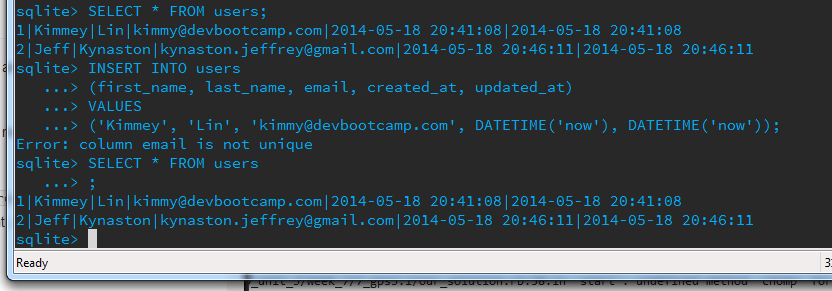
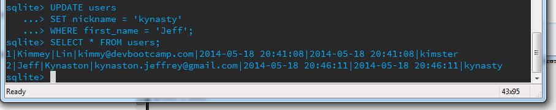
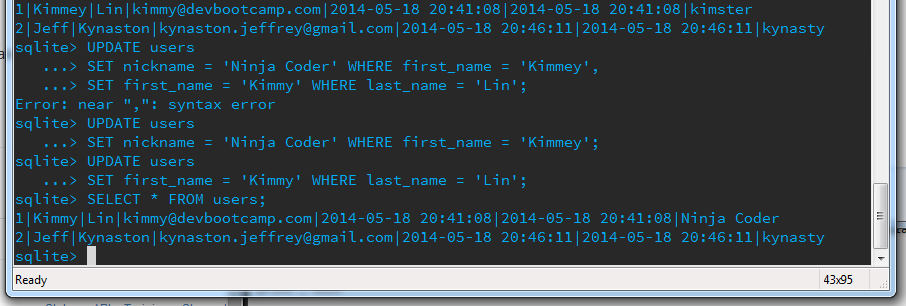

# U3.W7: Intro to SQLite

## Release 0: Create a dummy database

## Release 1: Insert Data 

## Release 2: Multi-line commands

## Release 3: Add a column

## Release 4: Change a value

## Release 5: Reflect

I like working with SQL through the command line much more than I liked using SQLzoo. It felt more real to me. I think it helped that we created the table and then worked with it, instead of writing queries to try to get data out of someone else's table. It's also how I'm used to doing this sort of thing. The small web-apps i've built as part of tutorials both used sql to manage databases. One even used sqlite, and i definitely remember deleting entries manually through the command line. 
